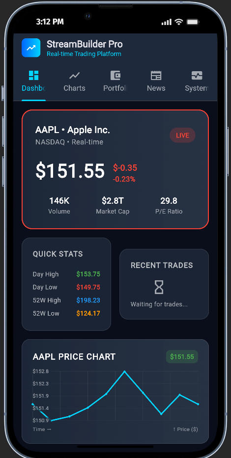
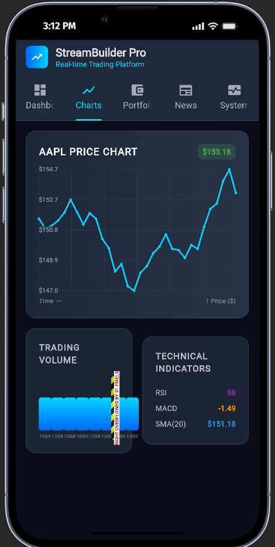
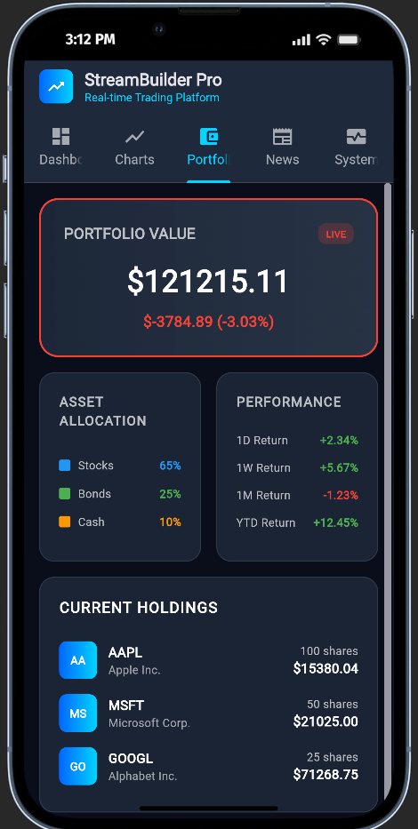
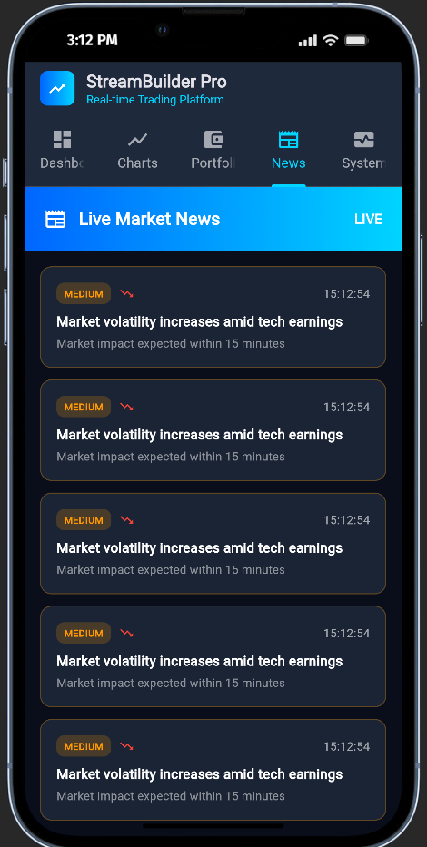
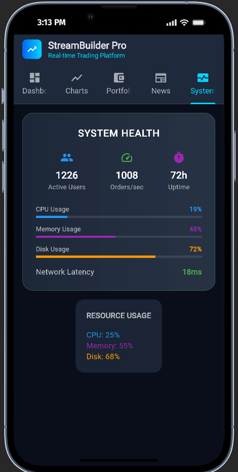

# 📈 StreamBuilder Pro - Real-time Trading Platform

<div align="center">


## 📱 **App Screenshots**

<table>
  <tr>
    <td align="center">
      
      <br/>
      <b>🏠 Dashboard</b>
      <br/>
      <sub>Live stock prices & trades</sub>
    </td>
    <td align="center">
      
      <br/>
      <b>📊 Charts</b>
      <br/>
      <sub>Interactive price charts</sub>
    </td>
    <td align="center">
      
      <br/>
      <b>💰 Portfolio</b>
      <br/>
      <sub>Live portfolio tracking</sub>
    </td>
  </tr>
  <tr>
    <td align="center">
      
      <br/>
      <b>📰 News</b>
      <br/>
      <sub>Breaking financial news</sub>
    </td>
    <td align="center">
      
      <br/>
      <b>🖥️ System</b>
      <br/>
      <sub>Server health monitoring</sub>
    </td>
    <td align="center">
      
      <br/>
      <b>🎬 Overview</b>
      <br/>
      <sub>StreamBuilder in action</sub>
    </td>
  </tr>
</table>

**A professional Flutter application demonstrating StreamBuilder widget with real-time data streaming**

*Built for educational purposes to showcase advanced Flutter concepts*

</div>

---

## 🎯 **Project Overview**

StreamBuilder Pro is a sophisticated trading platform simulation that demonstrates the power of Flutter's **StreamBuilder** widget. The app showcases real-time data updates, professional UI design, and clean architecture patterns - perfect for understanding reactive programming in Flutter.

### ✨ **Key Features**

- 🔴 **Real-time Data Streaming** - Live updates without manual refresh
- 📊 **Interactive Charts** - Custom painted price charts with live data
- 💰 **Portfolio Management** - Live portfolio tracking with P&L
- 📰 **Breaking News Feed** - Real-time financial news alerts
- 🖥️ **System Monitoring** - Live server health metrics
- 🎨 **Professional UI** - Dark theme with gradient cards and animations

---

## 🏗️ **Architecture**

This project follows **clean architecture principles** with proper separation of concerns:

```
lib/
├── 📁 models/           # Data classes and structures
├── 📁 services/         # Business logic and data streaming
├── 📁 screens/          # UI screens and navigation
├── 📁 widgets/          # Reusable StreamBuilder components
└── 📄 main.dart         # Application entry point
```

### 🔄 **StreamBuilder Pattern**

The app demonstrates the core StreamBuilder pattern used throughout:

```dart
StreamBuilder<DataType>(
  stream: dataService.stream,        // Listen to data stream
  initialData: defaultData,          // Show while loading
  builder: (context, snapshot) {     // Rebuilds automatically!
    return Widget(snapshot.data);    // Display live data
  }
)
```

---

## 📱 **App Features**

### 🏠 **Dashboard Tab**
- **Live Stock Prices** - AAPL stock with real-time updates (1.5s intervals)
- **Quick Stats** - Day high/low, 52-week ranges
- **Recent Trades** - Live buy/sell order feed
- **Mini Chart Preview** - Real-time price visualization

### 📊 **Charts Tab**
- **Interactive Price Chart** - Custom painted line chart with grid
- **Volume Bars** - Trading volume visualization
- **Technical Indicators** - RSI, MACD, SMA with live updates

### 💰 **Portfolio Tab**
- **Live Portfolio Value** - Real-time P&L tracking
- **Asset Allocation** - Investment breakdown (Stocks/Bonds/Cash)
- **Performance Metrics** - Returns across different time periods
- **Holdings List** - Individual stock positions with live values

### 📰 **News Tab**
- **Breaking News Feed** - Financial news alerts (8s intervals)
- **Impact Levels** - HIGH/MEDIUM/LOW classification
- **Sentiment Analysis** - Positive/negative market sentiment
- **Real-time Timestamps** - Live news delivery

### 🖥️ **System Tab**
- **System Health** - Active users, orders/second, uptime
- **Resource Usage** - CPU, memory, disk usage bars
- **Network Metrics** - Latency monitoring (3s intervals)

---

## ⚡ **Real-time Data Streams**

The app simulates realistic trading data with multiple timer-based streams:

| Stream Type | Update Interval | Purpose |
|-------------|----------------|---------|
| 📈 **Market Data** | 1.5 seconds | Stock prices, volume, trades |
| 📰 **News Alerts** | 8 seconds | Breaking financial news |
| 🖥️ **System Health** | 3 seconds | Server performance metrics |

### 🎛️ **Data Generation**

All data is generated using realistic algorithms:
- **Stock Prices** - Random walk with constraints
- **News Headlines** - Pool of 6 realistic financial headlines
- **System Metrics** - Fluctuating server performance data

---

## 🔧 **Technical Implementation**

### 📦 **Key Components**

#### **TradingService** (`services/trading_service.dart`)
- Central data hub managing all streams
- Timer-based data generation
- Broadcast streams for multiple listeners

#### **StreamBuilder Widgets**
- **MarketOverview** - Perfect StreamBuilder example
- **PriceChart** - StreamBuilder with CustomPainter
- **NewsFeed** - List-based StreamBuilder
- **SystemMonitor** - Metrics StreamBuilder

#### **Custom Painters**
- **ChartPainter** - Real-time price chart rendering
- Grid lines, price labels, and live data points

---

## 🎨 **UI/UX Design**

### 🌙 **Dark Theme**
- Professional trading platform aesthetic
- Blue gradient accent colors (`#0066FF` to `#00D4FF`)
- High contrast for readability

### 📱 **Responsive Layout**
- Tab-based navigation (5 tabs)
- Card-based component design
- Proper spacing and typography

### 🎯 **Visual Indicators**
- **Green/Red** - Profit/loss, positive/negative changes
- **Live Badges** - Real-time data indicators
- **Progress Bars** - System resource usage
- **Status Cards** - Trade execution states

---

## 🚀 **Getting Started**

### Prerequisites
- Flutter SDK (3.0+)
- Dart SDK (3.0+)
- IDE (VS Code, Android Studio, or IntelliJ)

### Installation

1. **Clone the repository**
   ```bash
   git clone https://github.com/Aman-Kasa/streambuilder_trading.git
   cd streambuilder_trading
   ```

2. **Install dependencies**
   ```bash
   flutter pub get
   ```

3. **Run the application**
   ```bash
   flutter run
   ```

---

## 📚 **Learning Objectives**

This project is perfect for understanding:

### 🎓 **Flutter Concepts**
- ✅ **StreamBuilder** widget usage
- ✅ **Stream** and **StreamController**
- ✅ **Timer.periodic** for data simulation
- ✅ **CustomPainter** for graphics
- ✅ **StatefulWidget** lifecycle
- ✅ **Clean architecture** patterns

### 🔄 **Reactive Programming**
- ✅ **Automatic UI updates** without setState()
- ✅ **Multiple listeners** on single stream
- ✅ **Error handling** in streams
- ✅ **Memory management** and disposal

### 🏗️ **Project Structure**
- ✅ **Separation of concerns**
- ✅ **Reusable components**
- ✅ **Service layer** architecture
- ✅ **Model classes** and data structures

---

## 🎬 **Demo & Presentation**

### 📋 **5-Minute Presentation Guide**

1. **Introduction** (30s) - Show app overview and real-time updates
2. **Architecture** (45s) - Explain file structure and separation
3. **StreamBuilder Core** (1m) - Demonstrate main pattern
4. **Data Service** (1m) - Show timer setup and broadcasting
5. **Live Demo** (1.5m) - Navigate tabs, show live updates
6. **Wrap-up** (30s) - Highlight key achievements

### 🎯 **Key Talking Points**
- "StreamBuilder automatically rebuilds UI when data changes"
- "No manual setState() calls needed"
- "Professional project structure for scalability"
- "Multiple StreamBuilders can listen to same stream"
- "Easy to add new data streams and UI components"

---

## 📊 **Code Statistics**

- **Total Files**: 8 Dart files
- **Lines of Code**: ~1,500 lines
- **StreamBuilder Widgets**: 9 instances
- **Custom Painters**: 2 implementations
- **Data Models**: 5 classes
- **Real-time Streams**: 4 concurrent streams

---

## 🤝 **Contributing**

This is an educational project, but contributions are welcome!

1. Fork the repository
2. Create a feature branch (`git checkout -b feature/amazing-feature`)
3. Commit your changes (`git commit -m 'Add amazing feature'`)
4. Push to the branch (`git push origin feature/amazing-feature`)
5. Open a Pull Request

---

## 🙏 **Acknowledgments**

- **Flutter Team** - For the amazing StreamBuilder widget
- **Dart Team** - For powerful async programming features
- **Community** - For inspiration and best practices
- **Coach** - Samiratu
---

<div align="center">

### 🌟 **Star this repository if it helped you learn StreamBuilder!**

**Built with ❤️ using Flutter & StreamBuilder**

*Perfect for Flutter developers learning reactive programming*

</div>

---

## 📞 **Contact**

- **Developer**: AMAN-KASA
- **Email**: a.kasa@alustudent.com
- **GitHub**: https://github.com/Aman-Kasa/streambuilder_trading.git

---

*This README was crafted with care to showcase the StreamBuilder Trading Platform project. Happy coding! 🚀*